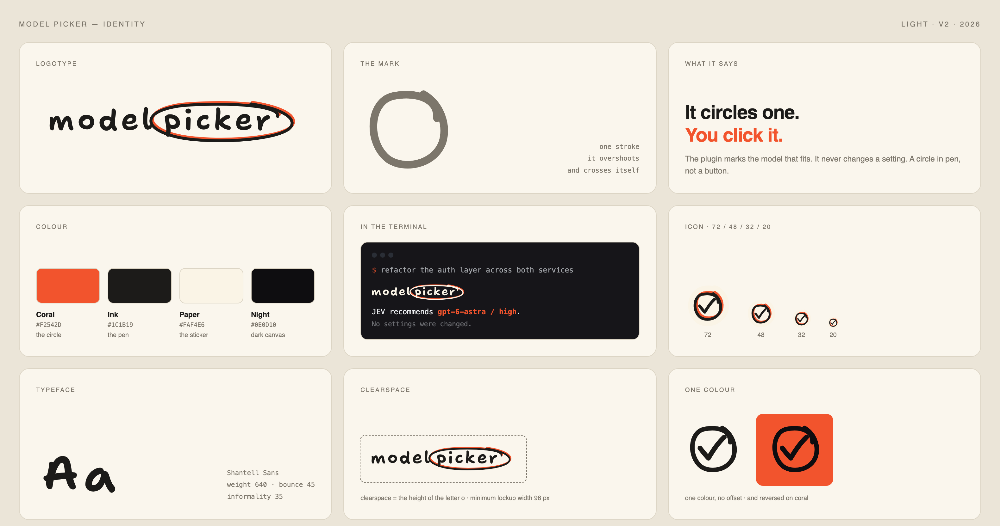

# Model Picker brand assets

The mark is a pen circle. One stroke, drawn round the word `picker`, that
overshoots the start and crosses itself — the way anyone circles the right
answer on paper. That is the product: it marks the model that fits, and you
click it. It never presses the button.



Three things make it look drawn rather than generated: the stroke is irregular,
the coral prints a couple of units off-register the way a cheap two-colour press
does, and a cream die-cut edge lets the sticker sit on any background.

## Files

| File | Use |
| --- | --- |
| `lockup-sticker.svg` · `.png` | The logo with its cream die-cut edge. Works on any background. Start here. |
| `lockup-light.svg` · `.png` | Ink on transparent, for light surfaces. |
| `lockup-dark.svg` · `.png` | Cream on transparent, for dark surfaces. |
| `lockup-mono.svg` | One colour. Inherits `currentColor`, no off-register. |
| `icon-*` | The pen circle and tick on its own, square. Same four variants, plus PNGs at 512 down to 16. |
| `*-sticker-grain.svg` | Same as `-sticker` with print grain in the coral. Use where a filter renders. |
| `sticker-print-2048.png` | Large, for printing real stickers. |
| `brand-board-{light,dark}.png` | The board above. Reference, not an asset to ship. |

The grain variants use an SVG filter. Most renderers handle it; the plain
`-sticker` files are the safe default.

## Colour

| Token | Hex | Role |
| --- | --- | --- |
| Coral | `#F2542D` | The circle. The only accent. |
| Ink | `#1C1B19` | The pen, on light surfaces. |
| Paper | `#FAF4E6` | The die-cut edge, and the pen on dark surfaces. |
| Night | `#0E0D10` | Dark canvas. |

Coral on paper is about 3.4:1, so it is fine for the circle and for large text,
but body text stays in ink.

## Type

Shantell Sans, weight 640, bounce 45, informality 35. The wordmark in the SVG
files is already outlined, so nothing needs the font installed to render it.
Shantell Sans is SIL Open Font License 1.1.

## Rules

- Clearspace on every side is the height of the letter `o`.
- Minimum lockup width is 96 px. Below that use the icon.
- Do not redraw the circle as a neat ellipse. The wobble and the overshoot are the mark.
- Do not recolour the pen, add a shadow, or rotate the lockup.
- On a photo or a busy surface, use `-sticker` so the mark keeps its own edge.

## Redrawing them

`build.py` draws every SVG from the geometry in one place. It needs `fonttools`
and the Shantell Sans variable font:

```sh
python3 -m venv venv && ./venv/bin/pip install fonttools
curl -L -o Shantell.ttf \
  "https://raw.githubusercontent.com/google/fonts/main/ofl/shantellsans/ShantellSans%5BBNCE%2CINFM%2CSPAC%2Cwght%5D.ttf"
./venv/bin/python build.py .
```

The PNGs are exported from those SVGs with headless Chrome at a transparent
background.
