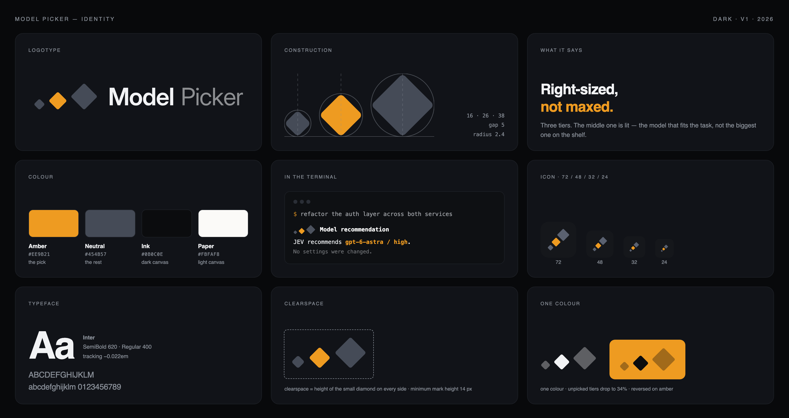

# Model Picker brand assets

The mark is three diamonds. They grow left to right, like model tiers. The
middle one is amber because it is the pick — the model that fits the task, not
the biggest one on the shelf. That is the whole product in one shape.



## Files

| File | Use |
| --- | --- |
| `lockup-{dark,light}.svg` · `.png` | Mark plus wordmark. README headers, docs, slides. |
| `mark-{dark,light}.svg` · `.png` | Mark on its own, horizontal. Inline next to a heading. |
| `icon-{dark,light}.svg` · `icon-*-{512..16}.png` | Square icon, transparent. Favicons, avatars, marketplace listings. |
| `appicon-{dark,light}.svg` · `-512.png` | Square icon on its own plate. App icons and tiles. |
| `mark-mono.svg` · `icon-mono.svg` | One colour. Inherits `currentColor`; unpicked tiers drop to 34%. |
| `brand-board-{dark,light}.png` | The board above. Reference, not an asset to ship. |

Pick `dark` for dark backgrounds and `light` for light ones. The amber is the
same in both; only the two unpicked diamonds change.

## Colour

| Token | Hex | Role |
| --- | --- | --- |
| Amber | `#EE9B21` | The pick. Never use it for anything else in the mark. |
| Neutral (dark bg) | `#454B57` | The two unpicked tiers. |
| Neutral (light bg) | `#C4C9D0` | The two unpicked tiers. |
| Ink | `#0B0C0E` | Dark canvas. |
| Paper | `#FBFAF8` | Light canvas. |

## Type

Inter. `Model` at weight 620, `Picker` at 400 and 55% opacity, tracking
−0.022em. The wordmark in the SVG files is already outlined, so nothing needs
Inter installed to render it. Inter is SIL Open Font License 1.1.

## Rules

- Clearspace on every side is the height of the small diamond.
- Minimum mark height is 14 px. Below that use the square icon.
- Do not recolour the amber diamond, reorder the tiers, or light a different one.
- Do not add a shadow, gradient, outline, or rotate the lockup.
- On a busy photo, use `appicon-*` so the mark keeps its own plate.

## Rebuilding

`assets/brand/build.py` draws every SVG from the geometry constants, and outlines
the wordmark from `Inter.ttf`. It needs `fonttools`. Run it from this directory:

```sh
python3 -m venv venv && ./venv/bin/pip install fonttools
curl -L -o Inter.ttf "https://raw.githubusercontent.com/google/fonts/main/ofl/inter/Inter%5Bopsz%2Cwght%5D.ttf"
./venv/bin/python build.py .
```

The PNGs are exported from those SVGs with headless Chrome. Geometry lives in
one place: diamond diagonals 16 / 26 / 38, gap 5, corner radius 2.4 for the
horizontal mark; 15 / 23 / 31, gap 6, radius 2.2 for the square icon.
